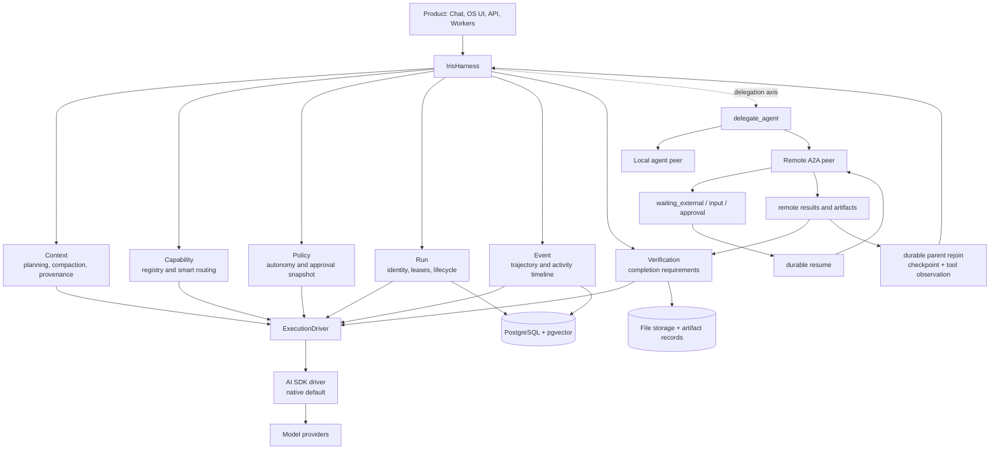

# Iris OS

**An open, self-hostable Harness Agent OS.**

Iris OS is a Next.js application for running model-driven work with explicit
context, capabilities, policy, durable run state, events, delegation, and
artifact verification. It combines chat, reusable agents, tools, MCP servers,
visual workflows, skills, scoped memory, local delegation, and remote
Agent-to-Agent (A2A) delegation in one operator-controlled deployment.

The native execution path uses the Vercel AI SDK. An `ExecutionDriver` registry
exists so additional drivers can be implemented, but **AI SDK is the only
execution driver shipped today**. Codex and Claude execution drivers are not
implemented.

[](https://modelcontextprotocol.io/introduction)
[](docs/tips-guides/docker.md)
[](LICENSE)

[](<https://vercel.com/new/clone?repository-url=https://github.com/dwickyfp/iris-os&env=BETTER_AUTH_SECRET&env=OPENAI_API_KEY&env=GOOGLE_GENERATIVE_AI_API_KEY&env=ANTHROPIC_API_KEY&envDescription=BETTER_AUTH_SECRET+is+required+(enter+any+secret+value).+At+least+one+LLM+provider+API+key+(OpenAI,+Claude,+or+Google)+is+required,+but+you+can+add+all+of+them.+See+the+link+below+for+details.&envLink=https://github.com/dwickyfp/iris-os/blob/main/.env.example&demo-title=Iris+OS&demo-description=The+open+operating+system+for+AI+agents,+tools,+and+workflows.&products=[{"type":"integration","protocol":"storage","productSlug":"neon","integrationSlug":"neon"},{"type":"integration","protocol":"storage","productSlug":"upstash-kv","integrationSlug":"upstash"},{"type":"blob"}]>)

## Implemented Features

This matrix describes code that is present in the repository. “Flagged” means
the implementation is server-gated and disabled by default, not that it is a
future design.

| Area | Implemented behavior | Availability |
| --- | --- | --- |
| **Harness runtime** | `IrisHarness` wraps native generation and streaming with context diagnostics, policy snapshots, lifecycle events, cancellation, terminal state, and completion verification | Core path; durable foreground `agent_run` creation is enabled with delegation |
| **Execution driver** | AI SDK `ToolLoopAgent` generation and streaming; duplicate-safe extensible driver registry | AI SDK native default and only shipped driver |
| **Chat** | Multi-model streaming, attachments, CSV ingestion previews, temporary chats, exports, voice, persisted incoming messages, and asynchronous memory review | Available |
| **Smart capability routing** | Server-authoritative registry for built-in tools, MCP, workflows, skills, local peers, and remote peers; requested capabilities support `prefer` and `only` routing | Available; peer delegation depends on flags |
| **Agents** | Reusable primary agents with instructions, model selection, assigned skills, and scoped capabilities | Available |
| **Local delegation** | Parent/child runs, permission intersection, depth/child/parallel limits, timeout, token budget, leases, heartbeat, cancellation propagation, and structured results | `IRIS_DELEGATION_V2` |
| **Remote agents / A2A** | Agent Card discovery, authenticated JSON-RPC A2A task send/get/cancel, durable polling, input/auth waiting, resume, cancellation, and artifact ingestion | `IRIS_DELEGATION_V2` + `IRIS_REMOTE_AGENTS_A2A` |
| **Run operations** | Queued/running/waiting/terminal states, run tree, timeline, retry-safe dispatch, stale-run sweep, and cancel tree | `IRIS_DELEGATION_V2`; requires `worker:iris` |
| **Canonical artifacts** | Storage-backed artifact records bound to user and run, SHA-256 metadata, verification history, and Markdown report generation | Available where artifact-producing tools run |
| **Verification** | Artifact reference, owner/run binding, storage existence, metadata, size, media type, and content hash checks; remote artifacts are canonicalized before success | Available |
| **MCP** | User-configured MCP servers, OAuth support, tool discovery, server/tool instructions, mentions, presets, and manual execution flow | Available; server creation can be disabled |
| **Built-in tools** | Exa search/content, HTTP, JavaScript/Python execution, charts, interactive tables, image generation/editing, and verified Markdown reports | Available when configured and permitted |
| **Workflows** | Visual model/tool graph builder, execution, publishing, and use as chat tools | Available |
| **Skills** | Assigned skill packages, files, allowlisted tools, runtime selection, revisions, archive/restore, and learned-skill promotion | Core skills available; learning promotion is flagged |
| **Memory** | Claims, topics, entities, edges, evidence, embeddings, provenance, conflict/correction lineage, exact global/workspace/task/agent scopes, recall, and 3D graph UI | Available; agentic writes default to shadow mode |
| **Workspaces and tasks** | Owner-scoped workspaces, instructions, thread/task association, task ledger, checkpoints, resources, Continue Work, archive, and explicit purge | `IRIS_WORKSPACES_V2` |
| **Learning** | Sanitized activity events, observations, candidates, evidence, review, suppression, and memory/skill/automation promotion paths | `IRIS_LEARNING_V2`; requires `worker:iris` |
| **Automation** | Workflow/skill/agent targets, schedules, approvals, idempotency, attempts, retries, timeout, cancellation, and run history | `IRIS_AUTOMATION_V2`; requires `worker:iris` |
| **Authentication and storage** | Better Auth, password and OAuth sign-in, PostgreSQL/pgvector, Vercel Blob or S3-compatible file storage | Available |
| **Operations UI** | Task operations, automation history, delegation tree/timeline, waiting/resume controls, remote-agent connections, and admin diagnostics | Corresponding V2 flags |

Supported model providers include OpenAI, Anthropic, Google, xAI, OpenRouter,
Ollama, Groq, and OpenAI-compatible endpoints. Foreground model selection and
internal system-engine assignments are configured independently.

## Execution Vocabulary

Iris keeps these concepts separate:

| Concept | Meaning in Iris OS |
| --- | --- |
| **Tool** | One model-callable operation with an input schema, such as web search, HTTP, code execution, report generation, or a tool exposed by MCP. A tool may read, mutate, or create an artifact. |
| **Workflow** | A user-authored visual graph of model and tool nodes. A published workflow can itself be exposed to chat as a tool. |
| **Agent** | A reusable specialist profile: instructions, model choice, skills, and allowed capabilities. An agent runs inside the harness; it is not the harness. |
| **Harness** | The control layer around execution. `IrisHarness` records identity, prepares context metadata, snapshots policy, manages run lifecycle, emits events, delegates work, and verifies completion before success. |
| **MCP** | Model Context Protocol integration for discovering and invoking tools from external MCP servers. MCP expands an agent’s tool surface; it does not represent another autonomous agent. |
| **A2A** | Agent-to-Agent JSON-RPC integration for delegating a bounded objective to a remote agent, following its task lifecycle, handling requests for input/auth, and receiving results or artifacts. |

MCP is the tool/connector axis. A2A is the delegation/peer-agent axis. Both are
capabilities resolved by the harness, but their protocols and trust boundaries
are different.

## Routing and Control UX

The composer separates who is responsible, what is available, and how much may
run without interruption:

- **Primary agent:** the persistent specialist selected for a thread. Its
  instructions and assigned skills shape the main model loop.
- **Peer agents:** local agents or configured remote A2A connections selected as
  delegation targets. They are capabilities of the primary agent, not
  replacements for it.
- **Capability hints:** mention tools, MCP servers/tools, workflows, skills, or
  peers. `Prefer` puts requested capabilities first while retaining other
  eligible capabilities. `Only` narrows routing to requested capabilities.
- **Standard autonomy:** tools are available and policy requires approval for
  destructive or unclassified operations.
- **Ask first:** all tool execution requires approval.
- **Off:** model tool calls are disabled for that response.

The browser sends routing hints, but the server rebuilds the eligible capability
set from authenticated ownership, configured allowlists, feature flags, and the
primary agent. Peer target IDs and tool permissions supplied by a client are not
authoritative.

## Root Run Flow

The following is the fully implemented path for a root chat run that delegates
analysis to a remote A2A peer and then creates a report. Delegation and report
generation are conditional model actions, not mandatory steps for every chat.

1. The chat route authenticates the user, loads or creates the thread, and
   enforces the stored workspace/task scope. The incoming user message is saved
   before streaming begins.
2. The selected model and primary agent are loaded. Iris resolves scoped memory,
   workspace/task instructions, skills, and conversation context. Oversized
   conversation history is compacted with provenance and token diagnostics.
3. The capability registry derives eligible built-in, MCP, workflow, skill,
   local-peer, and remote-peer capabilities. `prefer`/`only` hints reorder or
   narrow this server-authorized set.
4. The policy engine classifies tools as read-only, explicitly low-risk,
   high-risk, or unclassified and records the effective approval policy.
5. `IrisHarness.stream()` starts trajectory events and, when delegation is
   enabled, a durable root `agent_run`. The native AI SDK driver starts the
   `ToolLoopAgent` stream.
6. If the primary agent calls `delegate_agent`, Iris validates that the peer was
   in the root run’s eligible target snapshot. It creates an idempotent child
   run with bounded depth, timeout, token budget, and the intersection of parent,
   child, approved, and policy-permitted tools.
7. `worker:iris` claims the child with a lease and sends an A2A `message/send`
   request. Submitted or working tasks move to `waiting_external`, release the
   active lease, and are re-enqueued for polling rather than holding a web
   request open.
8. If the remote agent returns `input-required` or `auth-required`, the child
   moves to `waiting_input` or `waiting_approval`. The delegation timeline UI
   accepts the continuation; credentials are encrypted before persistence; the
   run resumes through the same remote task/context IDs.
9. On remote completion, the child result is stored as a provider-neutral tool
   observation. A durable parent-resume outbox reclaims the same root run,
   replaces the accepted `delegate_agent` result by exact `toolCallId`, and
   restarts reasoning from the persisted model-message checkpoint. Failed,
   cancelled, and timed-out children are also returned as observations so the
   parent can decide whether to retry, choose another peer, or report failure.
10. Inline text, JSON, or base64 file artifacts are bounded,
   normalized into Iris storage, bound to the child user/run, hashed, and
   verified. A failed artifact check fails the child instead of reporting
   success. The structured remote result is then available to the parent.
11. The parent may pass that analysis to `generate_report`. The tool creates a
    canonical Markdown artifact and verifies its database record, owner/run,
    storage key, filename, media type, size, storage metadata, existence, and
    SHA-256 content hash.
12. The harness inspects final output for artifact claims and runs completion
    verification before marking the trajectory successful. Failed verification
    produces `verification.failed`; it never silently becomes a successful run.
13. The complete resumed assistant response, including tool calls, tool results,
    and artifact references, is persisted with a deterministic message ID.
    Activity and trajectory events remain
    queryable, and asynchronous memory review is enqueued after a non-aborted,
    non-error response.

## Architecture



The `Context`, `Capability`, `Policy`, `Run`, `Event`, and `Verification`
components are harness concerns around the driver. Delegation is shown on a
separate axis because local/A2A child work has its own bounded lifecycle while
still returning observable results to the parent run.

## Durable Lifecycle

Agent runs use these persisted states:

```text
queued -> running -> waiting_external -> running -> succeeded
                  -> waiting_input ----^
                  -> waiting_approval -^
                  -> failed | cancelled | timed_out
```

- PgBoss jobs carry durable identifiers; the database run is authoritative.
- Workers claim queued work with lease tokens, heartbeat active work, and stop
  writing if a lease is lost.
- Remote `submitted`/`working` tasks store remote task/context IDs, transition
  to `waiting_external`, and are polled by later jobs.
- Input and one-time credentials are stored as continuations. Each continuation
  has stable submission/message IDs and is consumed when the run is reclaimed.
- Dispatch rows and idempotency keys prevent duplicate submission after queue
  redelivery or process failure.
- Parent checkpoints and join records reconnect asynchronous child completion to
  the original root reasoning trajectory without holding the foreground HTTP
  request open.
- The sweeper redispatches pending jobs and reclaims bounded stale work.
- Cancellation applies to a run tree, is checked during heartbeat, propagates to
  local execution, and attempts A2A `tasks/cancel` for active remote tasks.
- The operations UI exposes hierarchy, state, duration, budget, errors, timeline,
  cancellation, and resume controls without exposing chain-of-thought.

## Security and Trust Boundaries

Self-hosting keeps the database, storage, credentials, and provider accounts
under the operator’s control, but external models, MCP servers, remote agents,
tool output, files, and URLs remain untrusted inputs.

### Authorization and policy

- Route handlers authenticate with Better Auth and repositories scope remote
  agents, runs, workspaces, tasks, and resources to the owning user.
- Existing thread scope is authoritative; a client cannot move a stored thread
  by sending another workspace ID.
- Delegation targets come from a server-generated eligibility snapshot.
- Child permissions are intersected with parent tools, child skill tools,
  durable approval, and policy; a caller cannot widen them with JSON.
- Delegation is bounded to depth 3, 8 children per parent, 3 parallel children,
  a one-hour maximum timeout, and a 200,000 maximum token budget.
- Tool policy defaults unknown operations to approval-required. “Off” removes
  tools; it is not merely a UI label.
- Activity payloads and remote status metadata pass through centralized
  sanitization and size/secret filtering before durable event storage.

### Remote A2A and SSRF controls

Remote-agent endpoints cross a network trust boundary. Iris therefore:

- requires HTTPS and rejects credentials embedded in URLs;
- resolves DNS and rejects loopback, private, link-local, carrier-grade NAT,
  documentation, multicast, and other non-public IPv4/IPv6 ranges;
- pins each request to a validated DNS address to reduce DNS rebinding risk;
- validates every redirect and permits only bounded same-origin redirects;
- applies a 10-second default request timeout and 1 MiB default response limit;
- validates Agent Cards, JSON-RPC envelopes, response IDs, and normalized task
  states with schemas;
- bounds remote completion artifacts to 10 items and 5 MiB each, and accepts
  only the implemented inline text, structured-data, or base64-file forms.

These protections apply to the A2A provider’s secure outbound path. They should
not be read as a blanket claim that every third-party MCP server or built-in HTTP
tool has the same policy.

### Credentials and artifacts

- Remote bearer/API-key credentials and resume credentials are encrypted at
  rest with AES-256-GCM using `REMOTE_AGENT_ENCRYPTION_KEY`.
- Model-provider settings use the separate
  `MODEL_SETTINGS_ENCRYPTION_KEY` configuration.
- Remote-agent API responses omit encrypted values and expose only
  `hasCredential`.
- Canonical artifact references contain `artifactId`, `storageKey`, `filename`,
  `mediaType`, byte `size`, and `sha256`.
- Verification binds each artifact to the expected user and run, compares the
  full reference to the database, checks storage metadata and existence,
  downloads the object, recomputes SHA-256, and records the outcome.

Artifact verification proves identity, ownership, persistence, metadata, and
byte integrity. It does **not** prove that a report’s conclusions are factually
correct, that arbitrary tool output is safe, or that a remote agent is honest.

## Remote-Agent API and UX

Remote agents are disabled by default. Enable both delegation and A2A, run the
Iris worker, then use **Remote agents** in the sidebar.

The connections page supports:

- create, edit, enable/disable, and delete a connection;
- HTTPS endpoint and optional bearer or custom-header API-key credentials;
- initial Agent Card discovery on create and explicit rediscovery;
- credential replacement without returning the stored secret to the browser;
- active/disabled and discovery status.

Authenticated API routes:

| Method | Route | Behavior |
| --- | --- | --- |
| `GET`, `POST` | `/api/remote-agents` | List or create owned connections; create performs discovery |
| `GET`, `PATCH`, `DELETE` | `/api/remote-agents/:id` | Read, update, or delete one owned connection |
| `POST` | `/api/remote-agents/:id/discover` | Refresh the Agent Card |
| `POST` | `/api/remote-agents/:id/tasks` | Send an A2A task |
| `GET`, `DELETE` | `/api/remote-agents/:id/tasks/:taskId` | Read or cancel an A2A task |
| `GET` | `/api/agent-runs/:id/timeline` | Read an owned run, events, and child delegations |
| `POST` | `/api/agent-runs/:id/resume` | Resume an input/auth waiting run with a durable continuation |
| `DELETE` | `/api/agent-runs/:id` | Request cancellation of the owned run tree |

The direct task endpoints are useful for connection testing. Normal agentic use
goes through `delegate_agent`, durable child runs, the worker, and the operations
timeline.

## Quick Start

### Prerequisites

- [Node.js](https://nodejs.org/) **18 or newer**, matching
  `package.json#engines.node` (`>=18`)
- [pnpm](https://pnpm.io/) 10; the repository pins `pnpm@10.2.1`
- PostgreSQL with the `pgvector` extension
- At least one supported AI provider API key

### Local development

```bash
git clone https://github.com/dwickyfp/iris-os.git
cd iris-os
pnpm install

# pnpm install creates .env from .env.example when it does not exist.
# Set POSTGRES_URL, BETTER_AUTH_SECRET, and at least one provider API key.

# Start the repository's pgvector-enabled PostgreSQL service.
docker compose -f docker/compose.yml up -d postgres

pnpm db:migrate
pnpm dev
```

Open [http://localhost:3000](http://localhost:3000).

For a local production build, set `NO_HTTPS=1` or use:

```bash
pnpm build:local
pnpm start
```

### Full Docker stack

The Compose stack starts the web application, PostgreSQL, the memory worker,
and the Iris operations worker. It does **not** apply database migrations:

```bash
pnpm install
# Configure provider keys in docker/.env before starting the services.
docker compose -f docker/compose.yml up -d postgres
# Run an explicit one-off migration job on the Compose network.
docker compose -f docker/compose.yml run --rm iris-worker \
  node --conditions=react-server --import tsx scripts/db-migrate.ts
pnpm docker-compose:up
pnpm docker-compose:logs
```

Stop the stack with `pnpm docker-compose:down`. See the
[Docker hosting guide](docs/tips-guides/docker.md) for production setup.

### Vercel

Use the deployment button above or follow the
[Vercel hosting guide](docs/tips-guides/vercel.md). A managed PostgreSQL
database, authentication secret, and at least one model provider are required.
Background learning, automation, delegation, and A2A polling require a suitable
long-running Iris worker deployment; the Docker stack includes both workers by
default.

## Configuration

[`.env.example`](.env.example) is the source of truth.

| Group | Variables |
| --- | --- |
| **Required** | `POSTGRES_URL`, `BETTER_AUTH_SECRET`, and at least one provider API key |
| **Providers** | `OPENAI_API_KEY`, `ANTHROPIC_API_KEY`, `GOOGLE_GENERATIVE_AI_API_KEY`, `XAI_API_KEY`, `OPENROUTER_API_KEY`, `GROQ_API_KEY`, `OLLAMA_BASE_URL` |
| **Tools and MCP** | `EXA_API_KEY`, MCP configuration, OAuth, `NOT_ALLOW_ADD_MCP_SERVERS`, and `MCP_MAX_TOTAL_TIMEOUT` |
| **Storage** | Vercel Blob or S3-compatible storage settings |
| **Authentication** | Better Auth URL, sign-up policy, and Google, GitHub, or Microsoft OAuth credentials |
| **Optional infrastructure** | Redis for features that use shared cache or pub/sub |
| **Credential encryption** | `MODEL_SETTINGS_ENCRYPTION_KEY`, `REMOTE_AGENT_ENCRYPTION_KEY` |
| **V2 rollout** | `IRIS_WORKSPACES_V2`, `IRIS_LEARNING_V2`, `IRIS_AUTOMATION_V2`, `IRIS_DELEGATION_V2`, `IRIS_REMOTE_AGENTS_A2A`, `IRIS_MEMORY_CURATOR_MODE`, `IRIS_MEMORY_RECALL_MODE` |
| **Operations** | `OPERATIONS_METRICS_TOKEN`, `OPERATIONS_READY_TIMEOUT_MS`, `OPERATIONS_QUERY_TIMEOUT_MS`, `IRIS_WORKER_REQUIRED`, `IRIS_WORKER_STALE_AFTER_MS`, `IRIS_WORKER_HEARTBEAT_INTERVAL_MS`, `IRIS_WORKER_MAX_CONSECUTIVE_HEARTBEAT_FAILURES`, `IRIS_WORKER_ID` |

Generate secrets with:

```bash
npx @better-auth/cli@latest secret
openssl rand -base64 32  # use separate values for each encryption key
```

### Feature flags

All boolean V2 flags accept `1` or `true` and default off:

```dotenv
IRIS_WORKSPACES_V2=1
IRIS_LEARNING_V2=1
IRIS_AUTOMATION_V2=1
IRIS_DELEGATION_V2=1
IRIS_REMOTE_AGENTS_A2A=1

# Keep curation non-mutating until output has been reviewed in your environment.
IRIS_MEMORY_CURATOR_MODE=shadow

# Memory recall strategy: hybrid (lexical + semantic) or keyword (FTS only).
IRIS_MEMORY_RECALL_MODE=hybrid

# Base64-encoded, independent 32-byte keys.
MODEL_SETTINGS_ENCRYPTION_KEY=
REMOTE_AGENT_ENCRYPTION_KEY=
```

| Flag | Enables | Runtime requirement |
| --- | --- | --- |
| `IRIS_WORKSPACES_V2` | Workspace scope, task ledger, and corresponding UI | Web application |
| `IRIS_LEARNING_V2` | Activity processing, candidates, and learned artifacts | `worker:iris` |
| `IRIS_AUTOMATION_V2` | Durable schedules, approvals, retries, and run history | `worker:iris` |
| `IRIS_DELEGATION_V2` | Durable root/child agent runs, local delegation, timeline, resume, and cancellation | Web application + `worker:iris` |
| `IRIS_REMOTE_AGENTS_A2A` | Remote connection UI/API and A2A peers; effective delegation also requires `IRIS_DELEGATION_V2` | Web application + `worker:iris` |
| `IRIS_MEMORY_CURATOR_MODE` | `shadow` evaluation or reviewed memory writes | `worker:memory` |
| `IRIS_MEMORY_RECALL_MODE` | `hybrid` lexical plus semantic recall, or `keyword`-only full-text recall without embeddings | Web application + `worker:memory` |

## Migrations and Workers

The latest checked-in migration is `0047_memory_fts_indexes.sql`. Application
startup, worker startup, Docker startup, and package installation do not run
migrations. Apply migrations explicitly as a deployment job, with a dedicated
migration role, before starting or replacing web and worker processes:

```bash
pnpm db:migrate
```

The current additive schema includes remote connections and A2A state, durable
delegation and waiting/continuation state, canonical artifacts and verification,
parent/child rejoin fencing, and the `iris_worker_heartbeat` table added by
`0046`, and the memory full-text search GIN indexes added by `0047`. Treat the
complete checked-in migration set, not an older numeric range, as the release
unit.

For general database integration verification, use only a disposable database:

```bash
pnpm test:integration:db
```

By default that command starts `pgvector/pgvector:pg17`. Set
`TEST_POSTGRES_URL` only to an existing disposable PostgreSQL instance. Never
point the integration command at production. See the
[V2 migration verification guide](docs/iris-v2/migration-verification.md) for
the empty/legacy paths and forward-fix policy.

### Migration operations

Production promotion requires explicit, retained migration evidence. The
operations commands never fall back to `POSTGRES_URL`; they require a dedicated
`MIGRATION_DATABASE_URL`, an exact `MIGRATION_CONFIRM_DATABASE`, and
`MIGRATION_TARGET_KIND=disposable` or `staging-snapshot`. Production-like and
operator-denylisted targets are rejected, and there is no force/bypass flag.

```bash
# Against a confirmed disposable database or restored staging snapshot:
pnpm migration:rehearse
pnpm migration:integrity

# Requires a second, confirmed disposable MIGRATION_RESTORE_* target:
pnpm migration:rollback-drill

# Reads and validates the retained evidence; does not connect to PostgreSQL:
MIGRATION_ROLLOUT_POLICY=staging pnpm migration:rollout-gate
```

For `staging-snapshot`, also provide `MIGRATION_SNAPSHOT_RECEIPT`. Rehearsal,
integrity, and rollback evidence is written by default to
`artifacts/migration-operations/` as JSON, Markdown, and SHA-256 files. The gate
requires passing, hash-valid evidence for the current migration set, consistent
source database lineage, a distinct disposable restore, and, under the
`staging` policy, a representative snapshot receipt. It verifies evidence; it
does not authorize or execute a production migration. See
[Migration operations](docs/operations/migrations.md) for the complete variable
set, disposable two-database topology, hazard review, and restore procedure.

Worker responsibilities:

| Process | Responsibility |
| --- | --- |
| `pnpm worker:memory` | Asynchronous memory review and consolidation |
| `pnpm worker:iris` | Activity/learning, automation, local delegation, remote A2A polling, stale dispatch recovery, waiting/resume execution, and asynchronous parent rejoin |

PgBoss uses the same PostgreSQL database. The Vercel web deployment alone does
not provide these long-running worker loops.

`worker:iris` writes an identity/version heartbeat at startup and every
`IRIS_WORKER_HEARTBEAT_INTERVAL_MS` (10 seconds by default), removes it during a
graceful shutdown, and shuts itself down after the configured consecutive write
failure threshold. A heartbeat is current for readiness only within
`IRIS_WORKER_STALE_AFTER_MS` (45 seconds by default). The heartbeat interval
must be less than half the stale threshold.

`IRIS_WORKER_REQUIRED` is automatically effective when learning, automation,
delegation, or remote A2A is enabled. In that state, readiness requires both a
current Iris-worker heartbeat and pg-boss availability. Deployments that enable
those flags must run and supervise `pnpm worker:iris`; a healthy web process is
not sufficient.

### Health and metrics

| Endpoint | Contract |
| --- | --- |
| `GET /api/health/live` | Process liveness only; returns `200` with `{"status":"live"}` and does not probe dependencies |
| `GET /api/health/ready` | Returns `200` only when operations configuration, PostgreSQL, latest migration state, and any required worker/queue checks pass; otherwise `503` |
| `GET /api/metrics` | Prometheus text for runs, waits, leases, outboxes, activity, artifacts, A2A, parent joins, worker heartbeats, and pg-boss; requires `Authorization: Bearer $OPERATIONS_METRICS_TOKEN` |

```bash
curl --fail http://127.0.0.1:3000/api/health/live
curl --fail http://127.0.0.1:3000/api/health/ready
curl --fail \
  -H "Authorization: Bearer $OPERATIONS_METRICS_TOKEN" \
  http://127.0.0.1:3000/api/metrics
```

`OPERATIONS_METRICS_TOKEN` must be at least 32 characters and is required by
configuration in production. Health and metrics responses are uncached. Use
liveness only for process restart decisions and readiness for traffic admission;
do not use liveness as proof that migrations or workers are ready.

## Testing and Development

### Verification commands

```bash
pnpm lint
pnpm check-types
pnpm test
pnpm test:integration:db
pnpm build
pnpm test:e2e
pnpm test:e2e:harness
pnpm conformance:a2a
pnpm benchmark:a2a
```

| Command | Purpose |
| --- | --- |
| `pnpm dev` | Start the development server |
| `pnpm build` / `pnpm start` | Build and run the production application |
| `pnpm build:local` | Build with local HTTP enabled |
| `pnpm lint` | Run read-only Biome lint checks |
| `pnpm check-types` | Run TypeScript without emitting files |
| `pnpm test` / `pnpm test:watch` | Run Vitest once or in watch mode |
| `pnpm test:integration:db` | Run disposable PostgreSQL migration/integration tests |
| `pnpm test:e2e` / `pnpm test:e2e:ui` | Run Playwright headless or with its UI |
| `pnpm test:e2e:harness` | Build and run the isolated Harness Playwright suite with disposable PostgreSQL |
| `pnpm conformance:a2a` | Run deterministic local A2A JSON-RPC 0.3 and 1.0 conformance profiles |
| `pnpm benchmark:a2a` | Run the local durable A2A lifecycle benchmark in generated disposable PostgreSQL |
| `pnpm db:migrate` | Apply checked-in migrations |
| `pnpm migration:rehearse` | Apply and verify the migration set on an explicitly confirmed safe target |
| `pnpm migration:integrity` | Run independent read-only aggregate integrity checks |
| `pnpm migration:rollback-drill` | Back up and restore into a distinct disposable database, then verify integrity and flags-off behavior |
| `pnpm migration:rollout-gate` | Validate sealed migration evidence against the current migration set and rollout policy |
| `pnpm db:studio` | Open Drizzle Studio |
| `pnpm worker:memory` | Run the memory worker |
| `pnpm worker:iris` | Run learning, automation, delegation, and A2A jobs |

`pnpm check` is not a read-only verification command: it starts with
`pnpm lint:fix`, then runs types and unit tests. Use the explicit commands above
for audit-only checks.

### Disposable safety and evidence

- `pnpm test:e2e:harness` creates a uniquely named pgvector container on a
  random loopback-only port, uses a strict child-environment allowlist, builds
  into `.harness/<run-id>/next`, and removes the database container and temporary
  build/auth state on completion or handled termination. Its Playwright report
  remains at `.harness/<run-id>/report/`; retain that directory outside the
  workspace if it is release evidence.
- `pnpm conformance:a2a` starts deterministic loopback peers and prints JSON
  reports for both `legacy-0.3-jsonrpc` and `current-1.0-jsonrpc`, including wire
  evidence. This is local protocol evidence. To check a real peer, run
  `pnpm conformance:a2a -- --endpoint https://agent.example --token-env TOKEN_ENV`.
  Tokens are accepted only through the named environment variable. The CLI
  prints external results to stdout and does not persist them, so the repository
  contains no external-endpoint evidence unless an operator captures it in a
  release evidence system.
- `pnpm benchmark:a2a` requires Docker, creates its own uniquely named pgvector
  17 container and database on a random loopback-only port, ignores inherited
  application database URLs and service credentials, applies migrations through
  `0047`, verifies a generated database guard, and removes the container. It
  exercises pg-boss delivery, lease reclaim/fencing, and exactly-once parent
  rejoin for 10 iterations by default; set `A2A_BENCHMARK_ITERATIONS` from 1 to
  100. Each run writes local JSON evidence to
  `artifacts/benchmarks/a2a-disposable-<run-id>.json` with timings, invariants,
  migration status, cleanup status, and any error.
- Migration operations use separately confirmed targets and write sealed
  evidence to `artifacts/migration-operations/`. These commands are safe-target
  gates, not permission to point tests or drills at production.

The current workstream verification records passing local A2A 0.3 and 1.0
conformance profiles, a disposable A2A lifecycle benchmark, and the isolated
Harness Playwright suite. Benchmark runs produce the per-run JSON path above;
conformance output and Harness reports require explicit retention by the
operator. This is evidence for deterministic local implementations and isolation
controls, not proof of an arbitrary browser/device matrix, an external A2A
provider, production capacity, or a specific deployment.

### Repository structure

```text
src/app/          Next.js pages, route handlers, authentication, and middleware
src/components/   Product and reusable UI components
src/hooks/        Client data and application hooks
src/lib/ai/       Agents, harness runtime, capabilities, runs, tools, artifacts
src/lib/a2a/      A2A JSON-RPC provider
src/lib/security/ Secure outbound HTTP and credential encryption
src/lib/          Repositories, memory, jobs, workflows, and shared helpers
scripts/          Migrations, workers, benchmarks, and maintenance commands
tests/            Playwright and larger integration suites
docs/             Deployment, configuration, and architecture guides
docker/           Application image and local/full-stack Compose services
```

## Rollout Status and Limitations

The repository implements the harness, canonical artifacts, A2A connection and
task APIs, local/remote delegation worker, durable waiting/resume states, and
operations UX. The following limits are intentional statements of current code,
not a future-feature list:

- V2 subsystems and remote agents are disabled by default and require migrations,
  explicit flags, encryption keys, and worker processes.
- AI SDK is the only shipped `ExecutionDriver`. The registry is extensible, but
  there are no Codex, Claude CLI, or other external coding-agent drivers.
- A2A is an outbound client implementation. Iris does not expose itself as an
  inbound A2A server, and remote progress is polled rather than received by push
  notifications or streaming.
- Remote artifacts must be inline A2A text, data, or base64 file parts. URL-based
  artifact fetching is not implemented. Limits are 10 artifacts and 5 MiB per
  artifact.
- The operations resume UI supports requested text, bearer credentials, and
  custom-header API-key credentials. External authentication protocols beyond
  those credential forms require provider-specific integration.
- Artifact verification checks durable byte identity and ownership, not semantic
  correctness. The verification engine has a `tool_result` target type, but no
  general tool-result verifier is registered by default.
- `prefer` and `only` route among capabilities already authorized by the server;
  they are not a semantic planner guarantee that the model will invoke a
  particular tool or peer.
- Foreground chat remains a high-coupling streaming path. Durable run creation in
  that path is currently tied to delegation enablement, while harness trajectory
  events and stream finalization also operate during incremental migration.
- A web-only Vercel deployment does not execute the memory or Iris worker loops.
- Local A2A conformance covers deterministic JSON-RPC 0.3 and 1.0 peers. No
  retained external-endpoint conformance evidence is included in the repository.
- The local disposable benchmark establishes lifecycle invariants and baseline
  timings on one machine; it is not a production load, soak, failover, or
  capacity result.
- The Harness Playwright suite provides targeted desktop, Pixel 7, and automated
  accessibility checks in its local test environment. It does not establish
  general browser compatibility, manual accessibility conformance, or production
  readiness.
- Repository tests and local evidence cannot establish production capacity,
  external-provider reliability, secret configuration, disaster recovery,
  network policy, or the security posture of an operator’s MCP/A2A peers.

### Production gates

Do not describe a deployment as production-ready from repository tests alone.
Before enabling production traffic or V2 flags, require deployment-specific
evidence for all of the following:

1. Run the explicit migration job through `0047`; rehearse the exact current
   migration set against a representative staging snapshot, pass independent
   integrity and rollback drills, review migration hazards, and pass
   `MIGRATION_ROLLOUT_POLICY=staging pnpm migration:rollout-gate` with retained
   evidence.
2. Keep V2 flags off until their schema, encryption keys, worker deployment,
   queue, and rollback decision are verified. Confirm `/api/health/ready` fails
   when a required worker is absent and becomes ready only with a current
   heartbeat.
3. Protect and scrape `/api/metrics`; alert on readiness, stale/missing workers,
   queue lag/failures, expired leases, pending outboxes/joins, failed artifact
   verification, and A2A failures. Establish deployment-specific latency,
   throughput, saturation, and retention baselines.
4. Capture conformance evidence against each actual external A2A endpoint and
   exercise send/get/cancel, waiting input/auth, resume, timeout, polling,
   credential rotation, artifact bounds, and remote cancellation. Local profiles
   are necessary implementation evidence but not external interoperability proof.
5. Run representative load, soak, failover, backup/restore, security, outbound
   network, secret-rotation, browser, mobile, and manual accessibility checks in
   the deployment environment. Validate provider limits and failure behavior.
6. Confirm operational ownership, on-call alerts, incident and rollback
   procedures, evidence retention, and the intentional protocol/product limits
   listed above.

See [`ROADMAP.md`](ROADMAP.md) for engineering status and remaining
environment-specific rollout work.

## Guides

- [Docker hosting](docs/tips-guides/docker.md)
- [Vercel hosting](docs/tips-guides/vercel.md)
- [MCP server setup and tool testing](docs/tips-guides/mcp-server-setup-and-tool-testing.md)
- [MCP OAuth flow](docs/tips-guides/mcp-oauth-flow.md)
- [File storage drivers](docs/tips-guides/file-storage.md)
- [System prompts and customization](docs/tips-guides/system-prompts-and-customization.md)
- [OAuth sign-in](docs/tips-guides/oauth.md)
- [OpenAI-compatible providers](docs/tips-guides/adding-openAI-like-providers.md)
- [Temporary chat windows](docs/tips-guides/temporary_chat.md)
- [End-to-end testing](docs/tips-guides/e2e-testing-guide.md)
- [V2 migration verification](docs/iris-v2/migration-verification.md)
- [Migration operations](docs/operations/migrations.md)

## Contributing

Bug reports, feature ideas, documentation, translations, and code
contributions are welcome. Read the [Contributing Guide](CONTRIBUTING.md) before
opening a pull request or proposing a major change. For language contributions,
see the [translation guide](messages/language.md).

## Credits

Iris OS is maintained by [Dwicky Feri](https://github.com/dwickyfp). It is based
on the open-source project originally created by
[Choi Sung Keun](https://github.com/cgoinglove) and includes work from its
contributors. The upstream history and attribution are preserved in this
repository.

Iris OS is released under the [MIT License](LICENSE).
