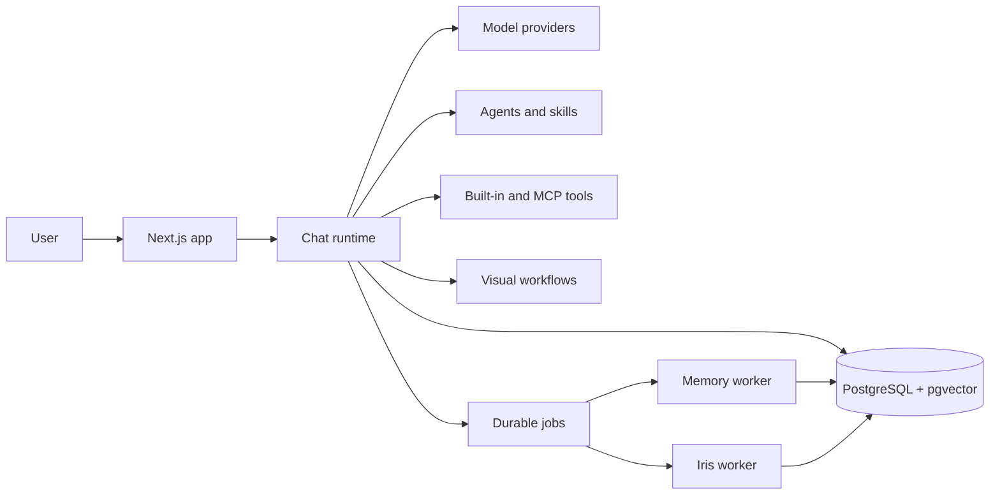

# Iris OS

**An open, self-hostable operating layer for AI work.**

Iris OS brings conversations, specialized agents, durable memory, tools,
workflows, and background execution into one workspace. Choose the model for
the job, connect external systems through the Model Context Protocol (MCP), and
keep ownership of your deployment, credentials, and data.

[](https://modelcontextprotocol.io/introduction)
[](docs/tips-guides/docker.md)
[](LICENSE)

[](<https://vercel.com/new/clone?repository-url=https://github.com/dwickyfp/iris-os&env=BETTER_AUTH_SECRET&env=OPENAI_API_KEY&env=GOOGLE_GENERATIVE_AI_API_KEY&env=ANTHROPIC_API_KEY&envDescription=BETTER_AUTH_SECRET+is+required+(enter+any+secret+value).+At+least+one+LLM+provider+API+key+(OpenAI,+Claude,+or+Google)+is+required,+but+you+can+add+all+of+them.+See+the+link+below+for+details.&envLink=https://github.com/dwickyfp/iris-os/blob/main/.env.example&demo-title=Iris+OS&demo-description=The+open+operating+system+for+AI+agents,+tools,+and+workflows.&products=[{"type":"integration","protocol":"storage","productSlug":"neon","integrationSlug":"neon"},{"type":"integration","protocol":"storage","productSlug":"upstash-kv","integrationSlug":"upstash"},{"type":"blob"}]>)

## What Iris OS does

| Area | Capabilities |
| --- | --- |
| **Chat** | Multi-model streaming conversations, attachments, temporary chats, exports, voice, and tool approval modes |
| **Agents** | Reusable specialists with custom instructions, skills, model selection, and scoped tool access |
| **Memory** | Durable claims, topics, entities, provenance, conflict resolution, scoped recall, and an interactive 3D memory globe |
| **Tools** | MCP servers and apps, web search, HTTP requests, JavaScript/Python execution, image generation, and interactive data views |
| **Workflows** | A visual flow builder whose published workflows can be invoked as tools from chat |
| **Skills** | Versioned skill packages that agents can use, restore, and improve from observed work |
| **Workspaces** | Optional isolated instructions, chats, tasks, and memory scopes for different contexts |
| **Operations** | Optional durable tasks, scheduled automation, delegated agent runs, approvals, retries, and admin diagnostics |

Iris OS supports OpenAI, Anthropic, Google, xAI, OpenRouter, Ollama, Groq, and
OpenAI-compatible providers. Model providers and internal system engines can be
configured independently from the admin settings.

> [!NOTE]
> Workspace, learning, automation, and delegation capabilities are V2 features
> controlled by environment flags. They are disabled by default so existing
> installations can migrate and enable each subsystem deliberately.

## Product principles

- **Open by design.** Self-hostable, extensible, and not tied to one model
  provider.
- **Action over answers.** Agents can use tools and execute multi-step work,
  not only generate text.
- **Human control.** Tool permissions, approvals, audit records, and explicit
  feature flags keep operators in charge.
- **Composable systems.** Models, agents, skills, tools, workflows, and memory
  remain useful independently and become more capable together.
- **Scoped context.** Workspace, task, agent, and global memory stay isolated
  and are enforced on the server.
- **Data ownership.** Your deployment controls its database, file storage,
  provider credentials, and retention policy.

## Quick start

### Prerequisites

- [Node.js](https://nodejs.org/) 18 or newer
- [pnpm](https://pnpm.io/) 10
- PostgreSQL with the `pgvector` extension
- At least one supported AI provider API key

### Local development

```bash
git clone https://github.com/dwickyfp/iris-os.git
cd iris-os
pnpm install

# pnpm install creates .env from .env.example when it does not exist.
# Set POSTGRES_URL, BETTER_AUTH_SECRET, and at least one provider API key.

# Start the repository's pgvector-enabled PostgreSQL service.
docker compose -f docker/compose.yml up -d postgres

pnpm db:migrate
pnpm dev
```

Open [http://localhost:3000](http://localhost:3000).

For a local production build, set `NO_HTTPS=1` or use:

```bash
pnpm build:local
pnpm start
```

### Full Docker stack

The Compose stack starts the web application, PostgreSQL, the memory worker,
and the Iris operations worker:

```bash
pnpm install
# Configure provider keys in docker/.env before starting the services.
pnpm docker-compose:up
pnpm docker-compose:logs
```

Stop the stack with `pnpm docker-compose:down`. See the
[Docker hosting guide](docs/tips-guides/docker.md) for production setup.

### Vercel

Use the deployment button above or follow the
[Vercel hosting guide](docs/tips-guides/vercel.md). A managed PostgreSQL
database, authentication secret, and at least one model provider are required.
Background V2 processing also needs a suitable long-running worker deployment;
the Docker stack includes both workers by default.

## Configuration

[`.env.example`](.env.example) is the source of truth for configuration. The
main groups are:

| Group | Variables |
| --- | --- |
| **Required** | `POSTGRES_URL`, `BETTER_AUTH_SECRET`, and at least one provider API key |
| **Providers** | `OPENAI_API_KEY`, `ANTHROPIC_API_KEY`, `GOOGLE_GENERATIVE_AI_API_KEY`, `XAI_API_KEY`, `OPENROUTER_API_KEY`, `GROQ_API_KEY`, `OLLAMA_BASE_URL` |
| **Tools** | `EXA_API_KEY`, MCP configuration, OAuth, restrictions, and timeout settings |
| **Storage** | Vercel Blob or S3-compatible storage settings |
| **Authentication** | Better Auth URL, sign-up policy, and Google, GitHub, or Microsoft OAuth credentials |
| **Optional infrastructure** | Redis for features that use shared cache or pub/sub |
| **Security** | `MODEL_SETTINGS_ENCRYPTION_KEY` for encrypted model-provider settings |

Generate a Better Auth secret with:

```bash
npx @better-auth/cli@latest secret
```

### V2 feature flags

Enable V2 capabilities incrementally after applying the latest database
migrations:

```dotenv
IRIS_WORKSPACES_V2=1
IRIS_LEARNING_V2=1
IRIS_AUTOMATION_V2=1
IRIS_DELEGATION_V2=1

# Keep agentic memory review non-mutating until its model and output have been
# verified in your environment. Change to write only after that review.
IRIS_MEMORY_CURATOR_MODE=shadow
```

| Flag | Enables | Runtime requirement |
| --- | --- | --- |
| `IRIS_WORKSPACES_V2` | Workspaces, scoped chat context, and task ledger | Web application |
| `IRIS_LEARNING_V2` | Background observations and safe learned-skill promotion | `worker:iris` |
| `IRIS_AUTOMATION_V2` | Durable schedules, runs, approvals, and retries | `worker:iris` |
| `IRIS_DELEGATION_V2` | Parent/child agent runs with bounded permissions | `worker:iris` |
| `IRIS_MEMORY_CURATOR_MODE` | `shadow` evaluation or reviewed memory writes | `worker:memory` |

Do not enable production flags before reviewing the
[V2 migration verification guide](docs/iris-v2/migration-verification.md).

## How the pieces fit together



The foreground chat runtime streams responses while composing agents, tools,
workflows, skills, and scoped memory. Durable jobs move memory review,
learning, automation, and delegated execution out of the request path. Both
workers use the same PostgreSQL-backed ownership, audit, and idempotency
boundaries as the web application.

## Highlights

### Scoped, agentic memory

Iris can recall durable knowledge across global, workspace, task, and agent
scopes. The Memory Center exposes provenance, confidence filtering, conflicts,
and related concepts in a theme-aware 3D globe. Memory review runs
asynchronously and preserves evidence and correction lineage instead of
silently replacing prior claims.

### MCP tools and tool control

Connect MCP servers, inspect their tools, and invoke tools with `@mentions` or
presets. Chat supports three tool modes:

- **Auto:** the model can call available tools when needed.
- **Manual:** the user approves tool calls before execution.
- **None:** tools are disabled for the response.

See [MCP server setup and tool testing](docs/tips-guides/mcp-server-setup-and-tool-testing.md).

### Agents, skills, and visual workflows

Agents combine instructions, tools, and skills into reusable specialists.
Visual workflows connect model and tool nodes into repeatable processes, then
publish those flows as callable chat tools. Learned procedures reuse the same
skill repository and runtime rather than introducing a separate execution
system.

### Built-in creative and compute tools

- Semantic web search and URL extraction through Exa
- Image generation and editing with supported provider models
- JavaScript and Python execution for calculation and transformation
- Interactive tables with search, filtering, pagination, and CSV/Excel export
- Bar, line, and pie chart generation
- Realtime voice through OpenAI's Realtime API with MCP access

## Development

### Common commands

| Command | Purpose |
| --- | --- |
| `pnpm dev` | Start the development server |
| `pnpm build` / `pnpm start` | Build and run the production application |
| `pnpm lint` | Run Biome lint checks |
| `pnpm check-types` | Run TypeScript without emitting files |
| `pnpm test` | Run the Vitest unit suite |
| `pnpm test:integration:db` | Run PostgreSQL integration tests |
| `pnpm test:e2e` | Run Playwright end-to-end tests |
| `pnpm db:migrate` | Apply checked-in Drizzle migrations |
| `pnpm db:studio` | Open Drizzle Studio |
| `pnpm worker:memory` | Run asynchronous memory review and consolidation |
| `pnpm worker:iris` | Run learning, automation, and delegation jobs |

`pnpm check` runs an auto-fixing lint pass before types and tests. Use the three
read-only commands below when you only want verification:

```bash
pnpm lint
pnpm check-types
pnpm test
```

### Repository structure

```text
src/app/          Next.js pages, route handlers, authentication, and middleware
src/components/   Product and reusable UI components
src/hooks/        Client data and application hooks
src/lib/          AI runtimes, repositories, memory, jobs, and shared helpers
scripts/          Migrations, workers, benchmarks, and maintenance commands
tests/            Playwright and larger integration suites
docs/             Deployment, configuration, and architecture guides
docker/           Application image and local/full-stack Compose services
```

## Guides

- [Docker hosting](docs/tips-guides/docker.md)
- [Vercel hosting](docs/tips-guides/vercel.md)
- [MCP server setup and tool testing](docs/tips-guides/mcp-server-setup-and-tool-testing.md)
- [MCP OAuth flow](docs/tips-guides/mcp-oauth-flow.md)
- [File storage drivers](docs/tips-guides/file-storage.md)
- [System prompts and customization](docs/tips-guides/system-prompts-and-customization.md)
- [OAuth sign-in](docs/tips-guides/oauth.md)
- [OpenAI-compatible providers](docs/tips-guides/adding-openAI-like-providers.md)
- [Temporary chat windows](docs/tips-guides/temporary_chat.md)
- [End-to-end testing](docs/tips-guides/e2e-testing-guide.md)
- [V2 migration verification](docs/iris-v2/migration-verification.md)

## Rollout status

The V2 storage, scoped memory, task, learning, automation, delegation, system
engine, and operations foundations are implemented behind flags. Local unit,
type, lint, migration, integration, production-build, and targeted browser
gates are in place. Before broad production enablement, each operator should
still complete a staging migration rehearsal, representative load and security
review, observability checks, and a rollback drill for their environment.

See [`ROADMAP.md`](ROADMAP.md) for the current engineering status and remaining
rollout work.

## Contributing

Bug reports, feature ideas, documentation, translations, and code
contributions are welcome. Read the [Contributing Guide](CONTRIBUTING.md) before
opening a pull request or proposing a major change. For language contributions,
see the [translation guide](messages/language.md).

## Credits

Iris OS is maintained by [Dwicky Feri](https://github.com/dwickyfp). It is based
on the open-source project originally created by
[Choi Sung Keun](https://github.com/cgoinglove) and includes work from its
contributors. The upstream history and attribution are preserved in this
repository.

Iris OS is released under the [MIT License](LICENSE).
